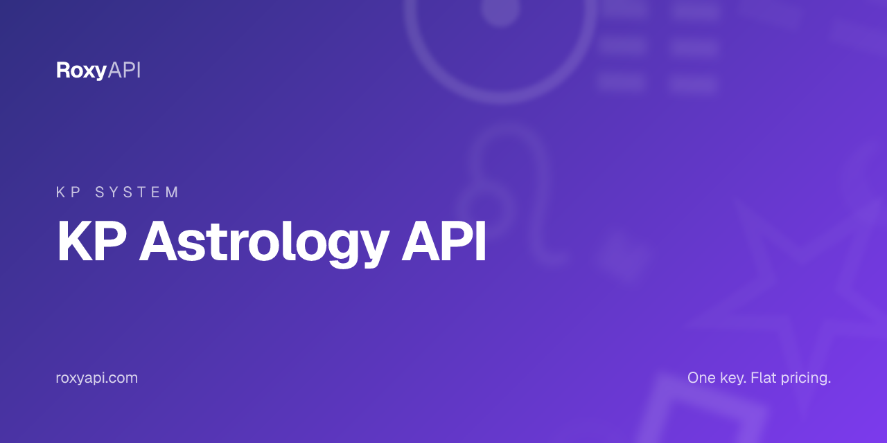

# KP Astrology API

> Sub lord and sub-sub lord precision for KP practitioners. One key covers 10 spiritual domains. MCP-first, verified against NASA JPL Horizons.

[](https://roxyapi.com/pricing)
[](https://roxyapi.com/api-reference)
[](https://roxyapi.com/methodology)
[](https://roxyapi.com/docs/mcp)
[](https://roxyapi.com/docs/sdk)

## What is KP Astrology API

KP astrology (Krishnamurti Paddhati) demands sub lord and sub-sub lord precision that generic Vedic APIs do not provide. This repo ships working TypeScript, JavaScript, and Python samples against the RoxyAPI KP chart endpoint. One subscription unlocks 10 spiritual domains: Vedic astrology, KP astrology, Western astrology, numerology, tarot, biorhythm, I Ching, crystals, dreams, and angel numbers. All positions are computed by Roxy Ephemeris, verified against NASA JPL Horizons.

## Why this API

| Property | Value |
|----------|-------|
| Coverage | 10 spiritual domains in one subscription |
| Calculation | Roxy Ephemeris, verified against NASA JPL Horizons |
| MCP server | `https://roxyapi.com/mcp/vedic-astrology` (Streamable HTTP, no local setup) |
| SDKs | TypeScript on npm `@roxyapi/sdk`, Python on PyPI `roxy-sdk` |
| Pricing | One key, flat per call, $39 for 25K calls |
| Licensing | No AGPL or GPL entanglement |
| Last verified | 2026-Q2 |

## Quick start

1. Get a key at [roxyapi.com/pricing](https://roxyapi.com/pricing)
2. Pick a language below
3. Copy the snippet, run, ship

### cURL

```bash
curl -X POST https://roxyapi.com/api/v2/vedic-astrology/kp/chart \
  -H "X-API-Key: $ROXY_API_KEY" \
  -H "Content-Type: application/json" \
  -d '{"date":"1990-07-04","time":"10:12:00","latitude":28.6139,"longitude":77.209,"timezone":5.5}'
```

### Python

```python
import os
from roxy_sdk import create_roxy

roxy = create_roxy(os.environ["ROXY_API_KEY"])

# KP astrology chart: full sub lord and sub-sub lord hierarchy for all 12 cusps and 9 planets
# Note: call roxy.location.search_cities(q="city") first to get coordinates
chart = roxy.vedic_astrology.generate_kp_chart(
    date="1990-07-04",
    time="10:12:00",
    latitude=28.6139,
    longitude=77.209,
    timezone=5.5,
)

print(chart["meta"]["ayanamsa"])         # 23.627...
print(chart["cusps"][0]["subLord"])      # KP sub lord of the first house cusp
print(chart["planets"][0]["subLord"])    # sub lord for the first planet
```

### JavaScript (Node)

```js
import { createRoxy } from '@roxyapi/sdk';

const roxy = createRoxy(process.env.ROXY_API_KEY);

// KP astrology chart: cuspal sub lord precision for KP predictive analysis
const { data, error } = await roxy.vedicAstrology.generateKpChart({
  body: {
    date: '1990-07-04',
    time: '10:12:00',
    latitude: 28.6139,
    longitude: 77.209,
    timezone: 5.5,
  },
});

if (error) throw new Error(error.error);

console.log(data.meta.ayanamsa);           // 23.627...
console.log(data.cusps[0].sign);           // Leo
console.log(data.planets[0].subLord);      // sub lord for Sun
```

### TypeScript

```ts
import { createRoxy } from '@roxyapi/sdk';

const roxy = createRoxy(process.env.ROXY_API_KEY!);

// KP astrology chart with full stellar hierarchy: star lord, sub lord, sub-sub lord
const { data, error } = await roxy.vedicAstrology.generateKpChart({
  body: {
    date: '1990-07-04',
    time: '10:12:00',
    latitude: 28.6139,
    longitude: 77.209,
    timezone: 5.5,
  },
});

if (error) throw new Error(error.error);

console.log(data.meta.ayanamsa);              // KP Newcomb ayanamsa value
console.log(data.cusps[0].subLord);           // sub lord of house 1 cusp
console.log(data.planets[0].subSubLord);      // sub-sub lord of Sun
console.log(data.significators.houseWise);    // house-wise significator table
```

## Request schema

| Field | Type | Required | Description |
|-------|------|----------|-------------|
| `date` | string | yes | Birth date, YYYY-MM-DD |
| `time` | string | yes | Birth time, HH:MM:SS (24-hour). Critical for accurate Lagna |
| `latitude` | number | yes | Birth latitude, -90 to 90 |
| `longitude` | number | yes | Birth longitude, -180 to 180 |
| `timezone` | number or string | no | UTC offset (e.g. 5.5) or IANA name (e.g. "Asia/Kolkata"). Defaults to 5.5 |
| `ayanamsa` | string | no | `kp-newcomb` (default), `kp-old`, `lahiri`, or `custom` |
| `ayanamsaValue` | number | no | Custom ayanamsa degrees. Use only when `ayanamsa` is `custom` |
| `nodeType` | string | no | `mean` (default) or `true`. Affects Rahu and Ketu sub-lord assignments in boundary cases |

## Response shape

```json
{
  "meta": {
    "date": "1990-07-04",
    "time": "10:12:00",
    "latitude": 28.6139,
    "longitude": 77.209,
    "timezone": 5.5,
    "ayanamsa": 23.62789473,
    "ayanamsaType": "kp-newcomb",
    "houseSystem": "placidus"
  },
  "ascendant": {
    "longitude": 138.4792,
    "sign": "Leo",
    "signLord": "Sun",
    "nakshatra": "Purva Phalguni",
    "nakshatraLord": "Venus",
    "pada": 2,
    "starLord": "Venus",
    "subLord": "Rahu",
    "subSubLord": "Jupiter",
    "kpNumber": 95
  },
  "cusps": [
    {
      "house": 1,
      "longitude": 138.4792,
      "sign": "Leo",
      "signLord": "Sun",
      "nakshatra": "Purva Phalguni",
      "nakshatraLord": "Venus",
      "pada": 2,
      "starLord": "Venus",
      "subLord": "Rahu",
      "subSubLord": "Jupiter",
      "kpNumber": 95
    }
  ],
  "planets": [
    {
      "planet": "Sun",
      "longitude": 78.3471,
      "sign": "Gemini",
      "house": 10,
      "nakshatra": "Ardra",
      "nakshatraLord": "Rahu",
      "pada": 4,
      "starLord": "Rahu",
      "subLord": "Moon",
      "subSubLord": "Rahu",
      "kpNumber": 53,
      "retrograde": false
    }
  ],
  "nodes": {
    "rahu": { "longitude": 285.0764, "sign": "Capricorn", "house": 5, "nakshatra": "Shravana", "starLord": "Moon", "subLord": "Jupiter", "subSubLord": "Sun", "kpNumber": 193 },
    "ketu": { "longitude": 105.0764, "sign": "Cancer", "house": 11, "nakshatra": "Pushya", "starLord": "Saturn", "subLord": "Jupiter", "subSubLord": "Jupiter", "kpNumber": 72 }
  },
  "significators": {
    "houseWise": [ ... ],
    "planetWise": [ ... ]
  }
}
```

| Field | Type | Description |
|-------|------|-------------|
| `meta` | object | Input echo plus computed `ayanamsa`, `ayanamsaType`, `houseSystem` |
| `ascendant` | object | Lagna with full KP stellar hierarchy: `starLord`, `subLord`, `subSubLord`, `kpNumber` |
| `cusps` | array[12] | Placidus house cusps with `sign`, `signLord`, `starLord`, `subLord`, `subSubLord` per cusp |
| `planets` | array[9] | Sun through Saturn with `sign`, `house`, `nakshatra`, `starLord`, `subLord`, `subSubLord`, `retrograde` |
| `nodes` | object | Rahu and Ketu with full KP stellar data |
| `significators.houseWise` | array[12] | Per-house significator list ranked by KP level (occupant star, occupant, owner star, owner) |
| `significators.planetWise` | array | Per-planet house list derived from the same four-level hierarchy |

## Common use cases

| Use case | Endpoint flow |
|----------|---------------|
| KP natal chart for a practitioner tool | Geocode birth city with `GET /location/search`, then POST to `/vedic-astrology/kp/chart` |
| Check which houses a planet signifies | Read `significators.planetWise` keyed by planet name |
| Horary question ("will X happen") | Use `/vedic-astrology/kp/ruling-planets` with current latitude and longitude |
| Compare sub lords across all 12 cusps | Iterate `cusps[].subLord` from the chart response |
| Build a KP significator table UI | Combine `significators.houseWise` and `significators.planetWise` |

## Related endpoints in this domain

- `POST /vedic-astrology/kp/planets` (`getKpPlanets`) - planet-level sub lord and sub-sub lord table without full cusp data
- `POST /vedic-astrology/kp/ruling-planets` (`getKpRulingPlanets`) - current ruling planets for horary KP astrology
- `POST /vedic-astrology/birth-chart` (`generateBirthChart`) - full Vedic kundli with nakshatra, retrograde, combustion, and house interpretations

## Use this in your AI agent

Connect Claude, GPT, Gemini, or Cursor to RoxyAPI through the remote MCP server. No Docker. No self hosting. The full MCP tool catalog for this domain is at `https://roxyapi.com/mcp/vedic-astrology`.

```json
{
  "mcpServers": {
    "vedic-astrology": {
      "url": "https://roxyapi.com/mcp/vedic-astrology",
      "headers": { "X-API-Key": "$ROXY_API_KEY" }
    }
  }
}
```

See [docs/mcp](https://roxyapi.com/docs/mcp) for Claude Desktop, Cursor, Windsurf, VS Code, and Claude Code setup.

## For AI coding agents

This repo ships an [AGENTS.md](AGENTS.md) execution playbook. Cursor, Claude Code, Aider, Codex, Windsurf, RooCode, and Gemini CLI will pick it up automatically. Top level overview lives at [roxyapi.com/AGENTS.md](https://roxyapi.com/AGENTS.md).

## Resources

- [Methodology and gold standard tests](https://roxyapi.com/methodology) verified against NASA JPL Horizons
- [Full API reference](https://roxyapi.com/api-reference) interactive Scalar UI
- [TypeScript SDK on npm](https://www.npmjs.com/package/@roxyapi/sdk)
- [Python SDK on PyPI](https://pypi.org/project/roxy-sdk/)
- [llms.txt](https://roxyapi.com/llms.txt) full LLM citation index
- [Top level AGENTS.md](https://roxyapi.com/AGENTS.md)

## Other RoxyAPI samples

[](https://github.com/RoxyAPI/kundli-api)
[](https://github.com/RoxyAPI/panchang-api)
[](https://github.com/RoxyAPI/dasha-api)
[](https://github.com/RoxyAPI/natal-chart-api)
[](https://github.com/RoxyAPI/synastry-api)

## License

MIT for this sample repo. See [LICENSE](LICENSE).

**Catalog licensing:** Personal and Commercial Use. No AGPL or GPL entanglement. Full posture at [roxyapi.com/policy/license](https://roxyapi.com/policy/license).

## Contact

- Site: [roxyapi.com](https://roxyapi.com)
- Status: [roxyapi.com/api-reference](https://roxyapi.com/api-reference)
