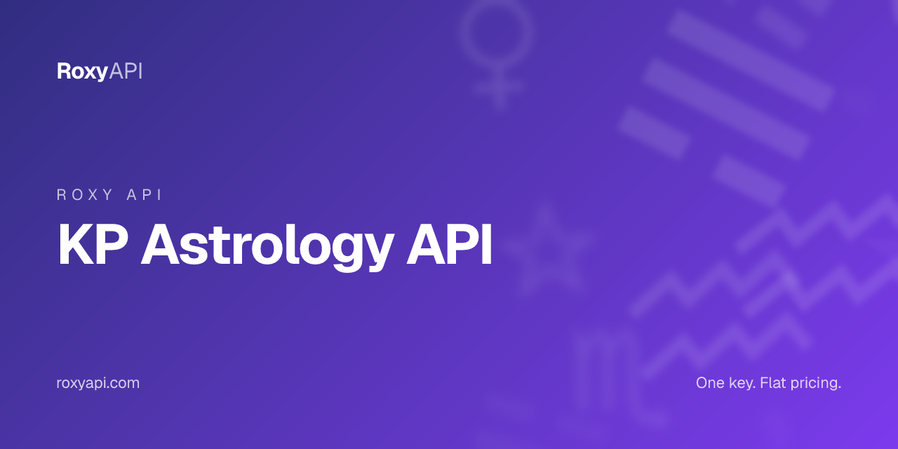

[](https://roxyapi.com/products/vedic-astrology-api)

# KP Astrology API

> Sub lord and sub-sub lord precision for KP practitioners. One key covers 18+ spiritual domains. MCP-first, verified against NASA JPL Horizons.

[](https://roxyapi.com/pricing)
[](https://roxyapi.com/api-reference)
[](https://roxyapi.com/methodology)
[](https://roxyapi.com/docs/mcp)
[](https://roxyapi.com/docs/sdk)

## What is KP Astrology API

KP astrology (Krishnamurti Paddhati) demands sub lord and sub-sub lord precision that generic Vedic APIs do not provide. This repo ships working TypeScript, JavaScript, and Python samples against the RoxyAPI KP chart endpoint. One subscription unlocks 18+ spiritual domains: Western astrology, Vedic astrology, Forecast, Human Design, Chinese astrology, Feng Shui, Mesoamerican astrology, Vastu, numerology, Kabbalah, tarot, biorhythm, Ayurveda, I Ching, crystals, dreams, angel numbers, and location. All positions are computed by Roxy Ephemeris, verified against NASA JPL Horizons.

## Why this API

| Property | Value |
|----------|-------|
| Coverage | 18+ spiritual domains in one subscription |
| Calculation | Roxy Ephemeris, verified against NASA JPL Horizons |
| MCP server | `https://roxyapi.com/mcp/vedic-astrology` (Streamable HTTP, no local setup) |
| SDKs | TypeScript on npm `@roxyapi/sdk`, Python on PyPI `roxy-sdk`, PHP on Packagist `roxyapi/sdk`, C# on NuGet `RoxyApi.Sdk`, Go `github.com/RoxyAPI/sdk-go`, WordPress plugin `roxyapi` |
| Pricing | One key, flat per call, from $39/mo |
| Licensing | Personal and commercial use, including closed source apps. No AGPL or GPL entanglement. [Full terms](https://roxyapi.com/policy/license) |
| Last verified | 2026-Q3 |

## Quick start

1. Get a key at [roxyapi.com/pricing](https://roxyapi.com/pricing)
2. Pick a language below
3. Copy the snippet, run, ship

### cURL

```bash
curl -X POST https://roxyapi.com/api/v2/vedic-astrology/kp/chart \
  -H "X-API-Key: $ROXY_API_KEY" \
  -H "Content-Type: application/json" \
  -d '{"date":"1990-07-04","time":"10:12:00","latitude":28.6139,"longitude":77.209,"timezone":5.5}'
```

### Python

```python
import os
from roxy_sdk import create_roxy

roxy = create_roxy(os.environ["ROXY_API_KEY"])

# KP astrology chart: full sub lord and sub-sub lord hierarchy for all 12 cusps and 9 planets
# Note: call roxy.location.search_cities(q="city") first to get coordinates
chart = roxy.vedic_astrology.generate_kp_chart(
    date="1990-07-04",
    time="10:12:00",
    latitude=28.6139,
    longitude=77.209,
    timezone=5.5,
)

print(chart["meta"]["ayanamsa"])         # 23.627...
print(chart["cusps"][0]["subLord"])      # KP sub lord of the first house cusp
print(chart["planets"][0]["subLord"])    # sub lord for the first planet
```

### JavaScript (Node)

```js
import { createRoxy } from '@roxyapi/sdk';

const roxy = createRoxy(process.env.ROXY_API_KEY);

// KP astrology chart: cuspal sub lord precision for KP predictive analysis
const { data, error } = await roxy.vedicAstrology.generateKpChart({
  body: {
    date: '1990-07-04',
    time: '10:12:00',
    latitude: 28.6139,
    longitude: 77.209,
    timezone: 5.5,
  },
});

if (error) throw new Error(error.error);

console.log(data.meta.ayanamsa);           // 23.627...
console.log(data.cusps[0].sign);           // Leo
console.log(data.planets[0].subLord);      // sub lord for Sun
```

### TypeScript

```ts
import { createRoxy } from '@roxyapi/sdk';

const roxy = createRoxy(process.env.ROXY_API_KEY!);

// KP astrology chart with full stellar hierarchy: star lord, sub lord, sub-sub lord
const { data, error } = await roxy.vedicAstrology.generateKpChart({
  body: {
    date: '1990-07-04',
    time: '10:12:00',
    latitude: 28.6139,
    longitude: 77.209,
    timezone: 5.5,
  },
});

if (error) throw new Error(error.error);

console.log(data.meta.ayanamsa);              // KP Newcomb ayanamsa value
console.log(data.cusps[0].subLord);           // sub lord of house 1 cusp
console.log(data.planets[0].subSubLord);      // sub-sub lord of Sun
console.log(data.significators.houseWise);    // house-wise significator table
```

## Request schema

| Field | Type | Required | Description |
|-------|------|----------|-------------|
| `date` | string | yes | Birth date, YYYY-MM-DD |
| `time` | string | yes | Birth time, HH:MM:SS (24-hour). Critical for accurate Lagna |
| `latitude` | number | yes | Birth latitude, -90 to 90 |
| `longitude` | number | yes | Birth longitude, -180 to 180 |
| `timezone` | number or string | no | UTC offset (e.g. 5.5) or IANA name (e.g. "Asia/Kolkata"). Defaults to 5.5 |
| `ayanamsa` | string | no | `kp-newcomb` (default), `kp-old`, `lahiri`, or `custom` |
| `ayanamsaValue` | number | no | Custom ayanamsa degrees. Use only when `ayanamsa` is `custom` |
| `nodeType` | string | no | `mean` (default) or `true`. Affects Rahu and Ketu sub-lord assignments in boundary cases |

## Response shape

```json
{
  "meta": {
    "date": "1990-07-04",
    "time": "10:12:00",
    "latitude": 28.6139,
    "longitude": 77.209,
    "timezone": 5.5,
    "ayanamsa": 23.62789473,
    "ayanamsaType": "kp-newcomb",
    "houseSystem": "placidus"
  },
  "ascendant": {
    "longitude": 138.4792,
    "sign": "Leo",
    "signLord": "Sun",
    "nakshatra": "Purva Phalguni",
    "nakshatraLord": "Venus",
    "pada": 2,
    "starLord": "Venus",
    "subLord": "Rahu",
    "subSubLord": "Jupiter",
    "kpNumber": 95
  },
  "cusps": [
    {
      "house": 1,
      "longitude": 138.4792,
      "sign": "Leo",
      "signLord": "Sun",
      "nakshatra": "Purva Phalguni",
      "nakshatraLord": "Venus",
      "pada": 2,
      "starLord": "Venus",
      "subLord": "Rahu",
      "subSubLord": "Jupiter",
      "kpNumber": 95
    }
  ],
  "planets": [
    {
      "planet": "Sun",
      "longitude": 78.3471,
      "sign": "Gemini",
      "house": 10,
      "nakshatra": "Ardra",
      "nakshatraLord": "Rahu",
      "pada": 4,
      "starLord": "Rahu",
      "subLord": "Moon",
      "subSubLord": "Rahu",
      "kpNumber": 53,
      "retrograde": false
    }
  ],
  "nodes": {
    "rahu": { "longitude": 285.0764, "sign": "Capricorn", "house": 5, "nakshatra": "Shravana", "starLord": "Moon", "subLord": "Jupiter", "subSubLord": "Sun", "kpNumber": 193 },
    "ketu": { "longitude": 105.0764, "sign": "Cancer", "house": 11, "nakshatra": "Pushya", "starLord": "Saturn", "subLord": "Jupiter", "subSubLord": "Jupiter", "kpNumber": 72 }
  },
  "significators": {
    "houseWise": [ ... ],
    "planetWise": [ ... ]
  }
}
```

| Field | Type | Description |
|-------|------|-------------|
| `meta` | object | Input echo plus computed `ayanamsa`, `ayanamsaType`, `houseSystem` |
| `ascendant` | object | Lagna with full KP stellar hierarchy: `starLord`, `subLord`, `subSubLord`, `kpNumber` |
| `cusps` | array[12] | Placidus house cusps with `sign`, `signLord`, `starLord`, `subLord`, `subSubLord` per cusp |
| `planets` | array[9] | Sun through Saturn with `sign`, `house`, `nakshatra`, `starLord`, `subLord`, `subSubLord`, `retrograde` |
| `nodes` | object | Rahu and Ketu with full KP stellar data |
| `significators.houseWise` | array[12] | Per-house significator list ranked by KP level (occupant star, occupant, owner star, owner) |
| `significators.planetWise` | array | Per-planet house list derived from the same four-level hierarchy |

## Common use cases

| Use case | Endpoint flow |
|----------|---------------|
| KP natal chart for a practitioner tool | Geocode birth city with `GET /location/search`, then POST to `/vedic-astrology/kp/chart` |
| Check which houses a planet signifies | Read `significators.planetWise` keyed by planet name |
| Horary question ("will X happen") | Use `/vedic-astrology/kp/ruling-planets` with current latitude and longitude |
| Compare sub lords across all 12 cusps | Iterate `cusps[].subLord` from the chart response |
| Build a KP significator table UI | Combine `significators.houseWise` and `significators.planetWise` |

## Daily KP flow in five requests

`daily-flow.ts` reads one day for one chart. It geocodes the birth city, makes five calls, and prints each layer of the reading on its own.

```bash
bun install
cp .env.example .env    # then add your key
bun run daily
```

| Request | Operation ID | What the sample prints from it |
|---------|--------------|-------------------------------|
| `POST /vedic-astrology/kp/chart` | `generateKpChart` | Sign, star and sub lord of the tracked cusps, then the four-level significator table for those houses |
| `POST /vedic-astrology/dasha/current` with `datetime` and `significators: true` | `getCurrentDasha` | The five running lords at that instant, the houses each signifies at L1 to L4, its KP strength grade, and the houses every level converges on |
| `POST /vedic-astrology/kp/ruling-planets` with `birthDate` and `birthTime` | `getKpRulingPlanets` | Ruling planets for the moment and the houses each of them signifies in this chart |
| `POST /vedic-astrology/kp/sublord-changes` with `planet: "Moon"` | `getKpSublordChanges` | Moon sub lord windows across the day with their exact boundary times |
| `POST /vedic-astrology/daily` | `getVedicDailyReading` | Verdict, score and finance band for the day, plus the finance composite band and its day, finance and natal layers |

Four details are worth copying:

- The cusps and the four-level significator table arrive in the same `kp/chart` response, so that is one request and not three.
- `datetime` on `dasha/current` pins the instant the five lords are read at, so a reading prepared for another day carries that day sookshma and prana; omit it and the call reads now. `significators: true` attaches each running lord star lord, sub lord, L1 to L4 houses and strength grade, so the periods and the houses they signify are one request.
- `birthDate` plus `birthTime` on `kp/ruling-planets` add the overlap check: which houses each ruling planet signifies in the natal chart.
- `startDate` and `endDate` on `kp/sublord-changes` are calendar days in the `timezone` you pass, so one local day is the same date in both, and every boundary comes back with its time in that timezone.

`weighDay()` at the top of the script is the one place a verdict would be computed, and it computes none. It joins the layers per house and prints them side by side. Which houses count as positive, whether a fast dasha level outranks a slow one, and what a ruling planet overlap is worth are all school choices, so the weighting stays yours.

### Render the five responses

Components are stateless. Fetch with the SDK, set `.data`, and the component renders. No build step needed.

```html
<script
  src="https://cdn.jsdelivr.net/npm/@roxyapi/ui@latest/dist/cdn/roxy-ui.js"
  crossorigin="anonymous"
  defer
></script>

<roxy-kp-chart id="chart"></roxy-kp-chart>
<roxy-dasha-timeline id="dasha"></roxy-dasha-timeline>
<roxy-kp-ruling-planets id="ruling"></roxy-kp-ruling-planets>

<script type="module">
  // chart, dasha and ruling are the three responses daily-flow.ts already fetched
  document.getElementById('chart').data = chart;
  document.getElementById('dasha').data = dasha;
  document.getElementById('ruling').data = ruling;
</script>
```

| Response | Component |
|----------|-----------|
| `generateKpChart` | `<roxy-kp-chart>` Ascendant, Placidus cusps, and planets and nodes in tabbed stellar-hierarchy tables |
| `getCurrentDasha` | `<roxy-dasha-timeline>` the Vimshottari ladder, mahadasha through prana, active period highlighted |
| `getKpRulingPlanets` | `<roxy-kp-ruling-planets>` day lord, Moon and Lagna stellar hierarchies, and the house significators |
| `getKpSublordChanges` | No dedicated component. The windows are a flat list, printed as a table by section 5 of the script |
| `getVedicDailyReading` | `<roxy-vedic-daily>` the composed daily reading: panchanga, gochara, dasha and the finance area for the day |

npm, React and Vue wrappers, the shadcn registry, and the theming tokens are all at [roxyapi.com/docs/ui](https://roxyapi.com/docs/ui).

## Related endpoints in this domain

- `POST /vedic-astrology/kp/planets` (`getKpPlanets`) - planet-level sub lord and sub-sub lord table without full cusp data
- `POST /vedic-astrology/kp/ruling-planets` (`getKpRulingPlanets`) - current ruling planets for horary KP astrology
- `POST /vedic-astrology/birth-chart` (`generateBirthChart`) - full Vedic kundli with nakshatra, retrograde, combustion, and house interpretations

## Use this in your AI agent

Connect Claude, GPT, Gemini, or Cursor to RoxyAPI through the remote MCP server. No Docker. No self hosting. The full MCP tool catalog for this domain is at `https://roxyapi.com/mcp/vedic-astrology`.

```json
{
  "mcpServers": {
    "vedic-astrology": {
      "url": "https://roxyapi.com/mcp/vedic-astrology",
      "headers": { "X-API-Key": "$ROXY_API_KEY" }
    }
  }
}
```

See [docs/mcp](https://roxyapi.com/docs/mcp) for Claude Desktop, Cursor, Windsurf, VS Code, and Claude Code setup.

## For AI coding agents

This repo ships an [AGENTS.md](AGENTS.md) execution playbook. Cursor, Claude Code, Aider, Codex, Windsurf, RooCode, and Gemini CLI will pick it up automatically. Top level overview lives at [roxyapi.com/AGENTS.md](https://roxyapi.com/AGENTS.md).

## Resources

- [Methodology and gold standard tests](https://roxyapi.com/methodology) verified against NASA JPL Horizons
- [Full API reference](https://roxyapi.com/api-reference) interactive Scalar UI
- [TypeScript SDK on npm](https://www.npmjs.com/package/@roxyapi/sdk)
- [Python SDK on PyPI](https://pypi.org/project/roxy-sdk/)
- [PHP SDK on Packagist](https://packagist.org/packages/roxyapi/sdk)
- [C# SDK on NuGet](https://www.nuget.org/packages/RoxyApi.Sdk)
- [Go SDK on pkg.go.dev](https://pkg.go.dev/github.com/RoxyAPI/sdk-go)
- [WordPress plugin](https://wordpress.org/plugins/roxyapi/)
- [llms.txt](https://roxyapi.com/llms.txt) full LLM citation index
- [Top level AGENTS.md](https://roxyapi.com/AGENTS.md)

## Other RoxyAPI samples

[](https://github.com/RoxyAPI/kundli-api)
[](https://github.com/RoxyAPI/panchang-api)
[](https://github.com/RoxyAPI/dasha-api)
[](https://github.com/RoxyAPI/natal-chart-api)
[](https://github.com/RoxyAPI/synastry-api)

## License

MIT for this sample repo. See [LICENSE](LICENSE).

**Catalog licensing:** Personal and commercial use, including closed source proprietary apps. No AGPL or GPL entanglement. RoxyAPI APIs and SDKs are safe to embed in commercial products. Full terms at [roxyapi.com/policy/license](https://roxyapi.com/policy/license).

## Contact

- Site: [roxyapi.com](https://roxyapi.com)
- Status: [roxyapi.com/api-reference](https://roxyapi.com/api-reference)
